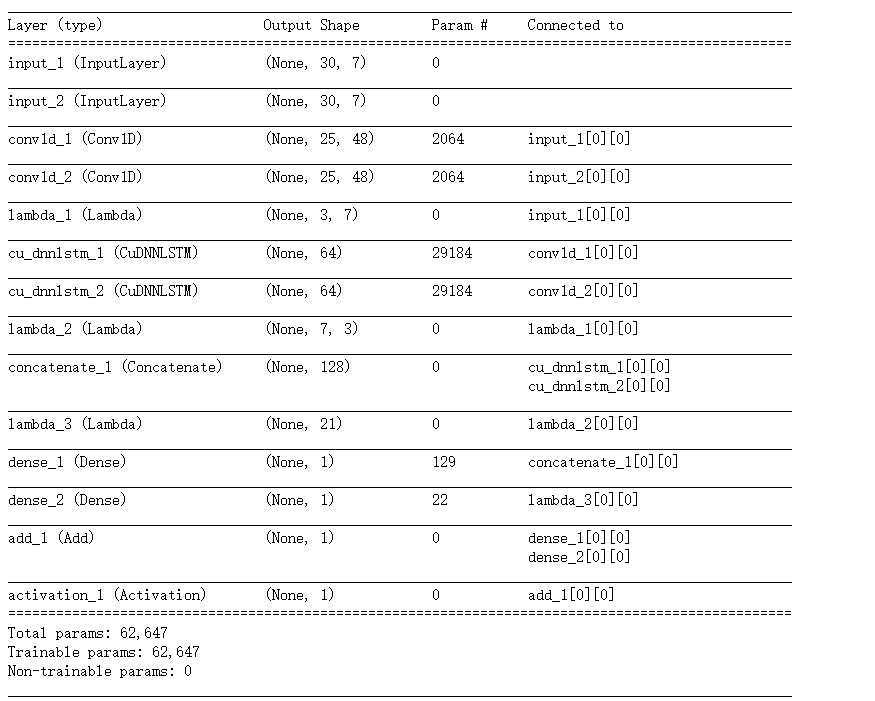
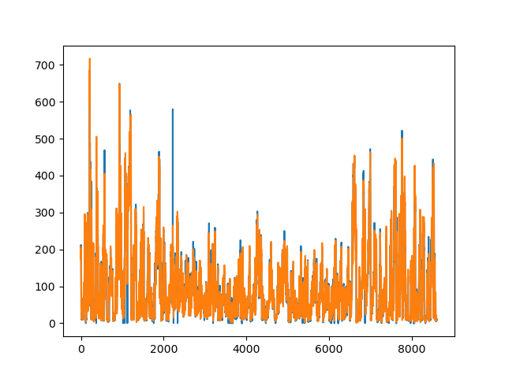

this project refer to  [LSTNet_keras](https://github.com/Lorne0/LSTNet_keras).

Provide a simple implementation of LSTNet and an out-of-box way about modeling,forecasting and evaluating(RMSE,MAE,MAPE).

---
Layers

---
Result

